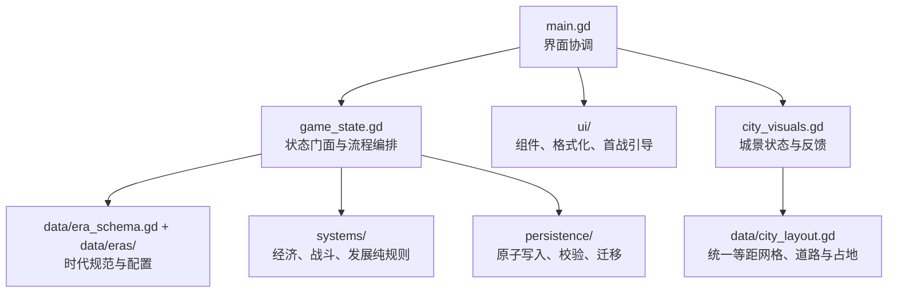

# 代码架构

当前重构以“保留 `State` 公共 API、把可变状态与纯规则分开”为原则。场景和测试仍可调用原有接口，数值系统则可以脱离界面进行固定种子模拟。

## 边界

- `src/game_state.gd`：唯一的运行时状态门面，负责日期推进、行为编排、信号、音效和埋点；启动阶段保持会话未激活，只有玩家明确载入或新建进度后才运行模拟与自动存档；旧调用方无需改名。
- `src/data/era_registry.gd`：时代顺序与配置入口；`State` 只通过注册表切换目录。
- `src/data/era_schema.gd`：时代配置 V2 的规范化层，为称谓、辎重、经济倍率、战役间隔、市易、政令和叙事提供完整默认值；旧目录缺字段时仍可安全读取。
- `src/data/eras/`：春秋至清的十四套目录分别声明城池等级、建筑、兵种、敌军、阵令、资源单位、绘卷背景、事件、辎重、战役节奏、经济和初始值。工厂方法每次返回独立可变数据。
- `src/systems/`：不读取全局单例的纯规则。经济账本、容量、交易、战斗和繁荣度均可无界面调用。
- `src/persistence/`：存档文件原子替换和备份恢复、结构/跨字段校验、旧版本迁移；`State` 只保留兼容门面和错误埋点。
- `src/ui/`：统一颜色与组件、数值文案格式化、首战状态引导；`main.gd` 负责页面生命周期和交互连接。
- `src/data/city_layout.gd`：定义 15×12 等距网格、大道禁建掩码、八类建筑占地、城级可建区域、坐标反算、落脚锚点与行深度。渲染、触控、放置、迁建、存档和校验共享这一份位置真相；v5 的十二槽位 ID 只作为旧存档迁移入口保留。

## 扩展约束

时代与城池双成长已经落地。每个新朝代提供与 `spring_autumn.gd` 同结构的目录配置，并在 `era_registry.gd` 中登记顺序；注册表先经 `EraSchema.normalize()` 补全配置，时代切换器只改变当前目录，不把朝代判断散落到经济、战斗或 UI。三个内部兵种 ID 只表示近战、远射、机动三个可跨时代继承的军籍角色；显示名称、计数单位、编制称谓、战力、维持、征募、敌军称谓及辎重负载均由时代配置决定。四个资源 ID 同理保持稳定，玩家看到的名称、简称和计量单位可随时代改变。城池等级是同一时代内的空间成长，配置建设容量、繁荣目标、城景缩放与可见范围；容量提升同时扩大网格可建区域。

经济、辎重与战役节奏都由正式系统消费配置，而不只是换文案：`EconomySystem` 应用各时代生产倍率、仓容、人口与军籍容量；`BattleSystem` 读取当前兵种的近战/远射参数；`State.get_logistics_status()` 根据仓廪、市易、采运设施与各兵种负载计算承载率，超载会实际降低训练效能；`battle_pacing` 控制时代化的围城间隔与败后整顿。UI、存档校验和无界面玩家共享这些入口。

存档 v5 在 v4 的 `era_id`、`era_progress` 与 `city_level` 之上新增 `building_instances`；v6 将其固定槽位改为 `grid_origin` 网格坐标；v7 一次性修复早期迁移将存量建筑挤向前两排的问题。修复器按占地从大到小将建筑分散到大道两侧和多个纵深，只更新 `grid_origin` 与兼容 `slot_id`，不修改实例 ID、类型、等级或任何经营数值。每座建筑拥有稳定实例 ID、类型、独立等级和完整占地；同类生产建筑可重复营造，城垣保持唯一，`buildings` 聚合值只供经济和旧 API 兼容。校验器会拒绝实例 ID 重复、跨越大道、占用未开放区域、建筑互相重叠、唯一建筑重复或聚合等级不一致的存档；v4/v5/v6 旧建筑会依次迁入合法空地。

新增规则应先进入 `systems/` 并通过无界面测试，再由 `State` 编排，最后接入 UI 和城景反馈。存档字段变化必须提升格式版本并在 `save_migrator.gd` 中提供迁移。
