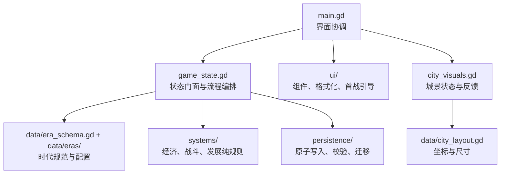

# 代码架构

当前重构以“保留 `State` 公共 API、把可变状态与纯规则分开”为原则。场景和测试仍可调用原有接口，数值系统则可以脱离界面进行固定种子模拟。

## 边界

- `src/game_state.gd`：唯一的运行时状态门面，负责日期推进、行为编排、信号、音效和埋点；旧调用方无需改名。
- `src/data/era_registry.gd`：时代顺序与配置入口；`State` 只通过注册表切换目录。
- `src/data/era_schema.gd`：时代配置 V2 的规范化层，为称谓、辎重、经济倍率、战役间隔、市易、政令和叙事提供完整默认值；旧目录缺字段时仍可安全读取。
- `src/data/eras/`：春秋至清的十四套目录分别声明城池等级、建筑、兵种、敌军、阵令、资源单位、绘卷背景、事件、辎重、战役节奏、经济和初始值。工厂方法每次返回独立可变数据。
- `src/systems/`：不读取全局单例的纯规则。经济账本、容量、交易、战斗和繁荣度均可无界面调用。
- `src/persistence/`：存档文件原子替换和备份恢复、结构/跨字段校验、旧版本迁移；`State` 只保留兼容门面和错误埋点。
- `src/ui/`：统一颜色与组件、数值文案格式化、首战状态引导；`main.gd` 负责页面生命周期和交互连接。
- `src/data/city_layout.gd`：建筑图、地图按钮和反馈特效共用的布局来源，避免坐标漂移。

## 扩展约束

时代与城池双成长已经落地。每个新朝代提供与 `spring_autumn.gd` 同结构的目录配置，并在 `era_registry.gd` 中登记顺序；注册表先经 `EraSchema.normalize()` 补全配置，时代切换器只改变当前目录，不把朝代判断散落到经济、战斗或 UI。三个内部兵种 ID 只表示近战、远射、机动三个可跨时代继承的军籍角色；显示名称、计数单位、编制称谓、战力、维持、征募、敌军称谓及辎重负载均由时代配置决定。四个资源 ID 同理保持稳定，玩家看到的名称、简称和计量单位可随时代改变。城池等级是同一时代内的空间成长，配置建筑槽位、繁荣目标、城景缩放与可见范围。

经济、辎重与战役节奏都由正式系统消费配置，而不只是换文案：`EconomySystem` 应用各时代生产倍率、仓容、人口与军籍容量；`BattleSystem` 读取当前兵种的近战/远射参数；`State.get_logistics_status()` 根据仓廪、市易、采运设施与各兵种负载计算承载率，超载会实际降低训练效能；`battle_pacing` 控制时代化的围城间隔与败后整顿。UI、存档校验和无界面玩家共享这些入口。

存档 v4 同时保存 `era_id`、`era_progress` 与 `city_level`。校验器先按时代选择合法目录，再检查建筑用地、仓容、人口、军籍、伤员队列、敌军与事件的跨字段一致性；v3 及更早存档统一迁入春秋，避免旧数值再次倍率换算。

新增规则应先进入 `systems/` 并通过无界面测试，再由 `State` 编排，最后接入 UI 和城景反馈。存档字段变化必须提升格式版本并在 `save_migrator.gd` 中提供迁移。
