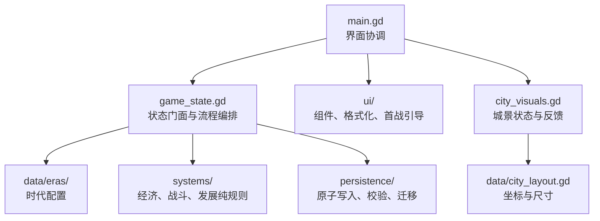

# 代码架构

当前重构以“保留 `State` 公共 API、把可变状态与纯规则分开”为原则。场景和测试仍可调用原有接口，数值系统则可以脱离界面进行固定种子模拟。

## 边界

- `src/game_state.gd`：唯一的运行时状态门面，负责日期推进、行为编排、信号、音效和埋点；旧调用方无需改名。
- `src/data/eras/spring_autumn.gd`：春秋阶段的建筑、兵种、敌军、事件、单位和初始值。工厂方法每次返回独立可变数据。
- `src/systems/`：不读取全局单例的纯规则。经济账本、容量、交易、战斗和繁荣度均可无界面调用。
- `src/persistence/`：存档文件原子替换和备份恢复、结构/跨字段校验、旧版本迁移；`State` 只保留兼容门面和错误埋点。
- `src/ui/`：统一颜色与组件、数值文案格式化、首战状态引导；`main.gd` 负责页面生命周期和交互连接。
- `src/data/city_layout.gd`：建筑图、地图按钮和反馈特效共用的布局来源，避免坐标漂移。

## 扩展约束

后续加入朝代与城池双成长线时，每个朝代提供与 `spring_autumn.gd` 同结构的目录配置；时代切换器只改变当前目录，不把朝代判断散落到经济、战斗或 UI。城池等级继续作为同一时代内的空间和建筑成长，并由布局数据决定可见范围与建筑槽位。

新增规则应先进入 `systems/` 并通过无界面测试，再由 `State` 编排，最后接入 UI 和城景反馈。存档字段变化必须提升格式版本并在 `save_migrator.gd` 中提供迁移。
